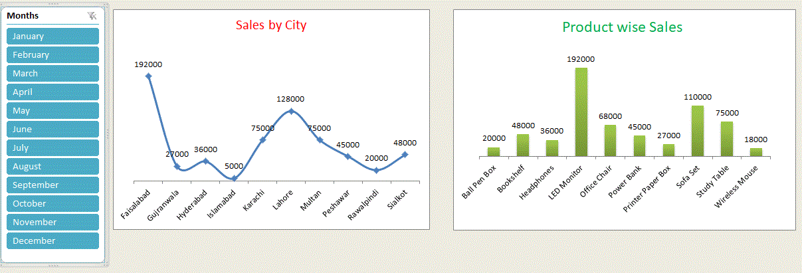
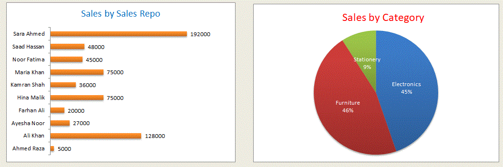
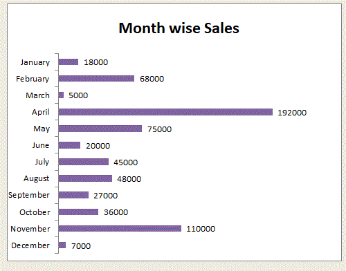

# Latest E-Commerce Sales Analytics Dashboard
I recently built a fully interactive Sales Analytics Dashboard in Microsoft Excel using Pivot Tables, Pivot Charts, and Slicers and I'm proud of how it turned out!  What this dashboard covers: Sales by City,Product-wise Sales,Sales by Sales Rep,Sales by Category, Month-wise Sales,Interactive Month Slicer.
## Dashboard Preview

---

## Dashboard Description

### Dashboard 1 — Sales by City & Product-wise Sales
This dashboard contains two interactive charts. The **Sales by City Line Chart** 
visualizes total revenue across 10 Pakistani cities — Faisalabad leads with 
PKR 192,000, followed by Lahore (128,000) and Karachi (75,000). The 
**Product-wise Sales Bar Chart** shows LED Monitor as top product at 192,000, 
followed by Sofa Set (110,000). A Month Slicer on the left filters both 
charts dynamically.

### Dashboard 2 — Sales by Sales Rep & Sales by Category
The **Sales by Rep horizontal bar chart** ranks 10 sales representatives — 
Sara Ahmed is the top performer at PKR 192,000, followed by Ali Khan (128,000). 
The **Sales by Category Pie Chart** shows Furniture leads at 46%, Electronics 
at 45%, and Stationery at 9% of total sales.

### Dashboard 3 — Month-wise Sales
A horizontal bar chart showing monthly revenue throughout the year. 
**April** is the peak month at PKR 192,000, followed by November (110,000) 
and May (75,000). March recorded the lowest at 5,000 — revealing clear 
seasonal business trends.

### Pivot Table Summary
The Pivot Table is the data foundation for all dashboards, summarizing 
sales across 5 dimensions: Cities, Products, Sales Reps, Categories, 
and Months. Total combined sales: **PKR 651,000**.

---

## Key Business Insights

-  **Top City:** Faisalabad — PKR 192,000 in total sales
-  **Best Sales Rep:** Sara Ahmed — PKR 192,000 revenue generated
-  **Best Product:** LED Monitor — PKR 192,000 in sales
-  **Leading Category:** Furniture — 46% of total sales
-  **Peak Month:** April — PKR 192,000 highest monthly revenue
-  **Slowest Month:** March — PKR 5,000 lowest monthly revenue

---

##  Tools & Technologies Used

| Tool | Purpose |
|------|---------|
| Microsoft Excel | Main platform for data, analysis & dashboard |
| Pivot Tables | Data summarization across multiple dimensions |
| Pivot Charts | Visual representation of Pivot Table data |
| Slicers | Interactive month-based filtering |
| Line Chart | Sales trend across cities |
| Bar & Column Chart | Product & sales rep comparison |
| Pie Chart | Category-wise sales distribution |

---

## Skills Demonstrated

- Data Cleaning & Organization
- Pivot Table Creation & Customization
- Interactive Dashboard Design
- Business Data Analysis & Insights
- Chart Formatting & Visualization
- Slicer Integration for Dynamic Filtering
- Sales KPI Reporting

##  About Me

Aspiring **Data Analyst** passionate about turning raw data into 
meaningful business insights using Excel, Pivot Tables & Dashboards.

